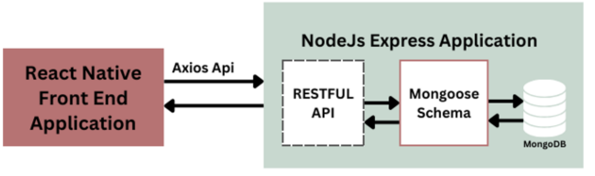
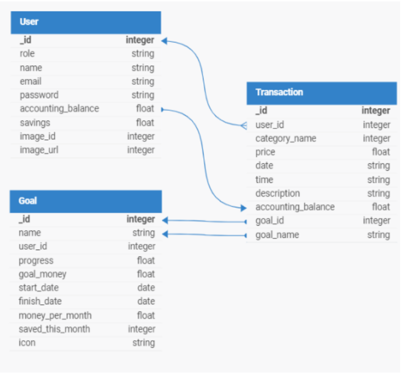

# BudgetPlanner: Expense Tracking and Savings Goals App


A cross-platform mobile app for tracking daily spending and saving towards
personal goals. Transactions are grouped into categories, so it's easy to see
where the money goes. Savings goals show how much to put aside each month to
reach them on time.

Diploma thesis, Department of Electrical and Computer Engineering, University of
Patras (October 2024), supervised by Prof. Nikolaos Avouris:
*Design and Development of an Expense Management and Budgeting Application*.
[Thesis](https://hdl.handle.net/10889/28419) ·
[presentation slides (Greek)](docs/presentation.pdf)

<p align="center">
  
  <br>
  <em>App walkthrough (4× speed) · <a href="final.mp4">full video</a></em>
</p>

## Why this app

Financial illiteracy is common, and traditional methods such as spreadsheets
are tedious and hard to keep up with. The goal was a simple app that tackles
the everyday problems of managing money: knowing where it goes, and actually
saving for the things that matter.

## Screens

| Sign in | Home | Transactions |
|---|---|---|
|  |  |  |

| Savings goals | New goal | Profile |
|---|---|---|
|  |  |  |

## Features

- **Home.** An instant overview: available balance, total savings across active
  goals, bar charts of spending per category for this month and last month,
  and the active savings goals.
- **Transactions.** A searchable list grouped by date, with a category tag on
  each transaction. A transaction can be linked to a savings goal, or unlinked
  from one.
- **Savings goals.** Set a goal with a target amount, end date and icon. The app
  works out how much to save each month and shows progress visually. Users can
  add or remove money, edit or delete a goal, and spend from their savings.
- **Automatic monthly recalculation.** On the 1st of every month, the backend
  resets each goal's monthly counter and recalculates the monthly target from
  the remaining amount and months left.
- **Profile.** Edit personal details and profile picture, change the password,
  and toggle push notifications.
- **Accounts.** Sign-up and sign-in with JWT authentication, plus a password
  reset by emailed code.

## Design process

The app follows a **human-centred design** approach. Before any development, a
Google Forms survey collected information on users' spending, budgeting methods,
saving challenges and financial goals. Some of the findings:

| Spending | Budgeting methods | Goals and saving |
|---|---|---|
| 84% prioritise basic needs | 44% don't know any formal budgeting method | 53% have short-term goals |
| 51% see shopping as non-essential | 40% struggle to keep track of their spending | 30% have long-term goals |
| 10% focus on entertainment and hobbies | 25% have tried the 50/30/20 rule, 17% use Excel | |

The findings, along with the **PACT** framework (People, Activities, Contexts,
Technologies), guided the design towards simplicity, clear spending categories
and a strong focus on savings goals. The result is four main screens: Home,
Transactions, Savings and Profile.

## Architecture

The app follows a client–server model. The React Native front end talks to a
RESTful Node.js/Express API through Axios. The API stores data in MongoDB Atlas
through Mongoose schemas and is hosted on Render.

<p align="center">
  
</p>

The data model has three main entities: **User** (profile and balance),
**Transaction** (each financial transaction, optionally linked to a goal) and
**Goal** (target amount, dates, progress, monthly target).

<details>
<summary><strong>Database schema</strong></summary>
<p align="center"></p>
</details>

## Testing and evaluation

- **Simulated transactions.** A Python script generated realistic bank
  transactions. It was used to test balance handling, spending categorisation,
  data integrity and performance under load.
- **Usability evaluation.** A **Cognitive Walkthrough** covered five key tasks:
  creating a savings goal, editing it, deleting it, adding money to it, and
  spending from savings. Users found the app generally intuitive. The main
  recommendations were to make actions more visible and feedback messages
  clearer.

## Future work

- Integration with real bank accounts.
- Personalised financial advice.

## Tech stack

| Layer | Tools |
|---|---|
| Mobile app | React Native, Expo, Expo Router, React Navigation |
| UI and charts | React Native Paper, react-native-chart-kit, circular progress indicators |
| State | React Context (auth, transactions, categories, goals), AsyncStorage |
| Backend | Node.js, Express, MongoDB Atlas with Mongoose, hosted on Render |
| Services | JWT and bcrypt (auth), SendGrid (email), Cloudinary (images), node-cron |
| Testing | Python (transaction simulation), Cognitive Walkthrough |

## Running it

```bash
npm install
npx expo start
```

Then scan the QR code with the Expo Go app, or press `i` or `a` to open an iOS
or Android simulator.

## Project structure

```
app/            # Expo Router entry and screens (sign in, home, expenses, savings, profile…)
components/     # UI components grouped by feature (home, expenses, savings, profile…)
context/        # React Context providers: auth, transactions, categories, goals
constants/      # theme, icons
assets/images/  # logos, backgrounds, tab-bar and goal icons
docs/           # demo GIF, screenshots, diagrams and presentation slides
```
