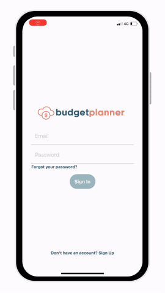
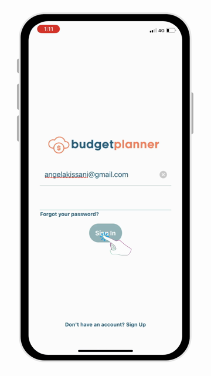
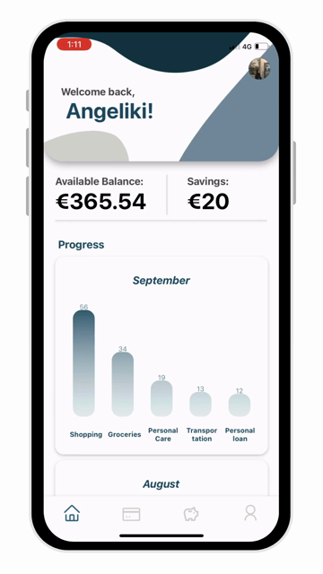
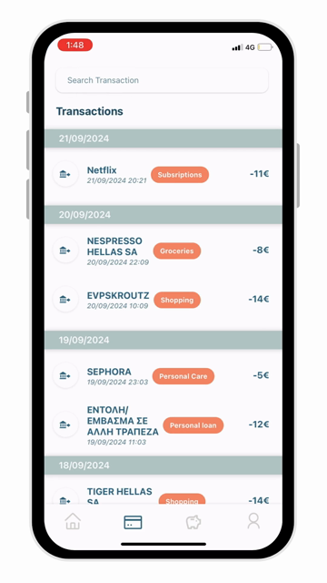
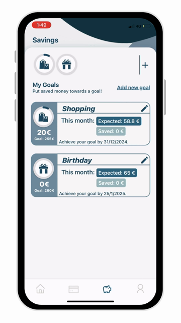
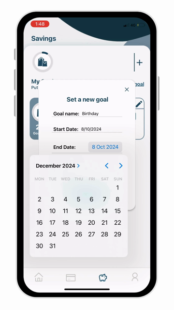
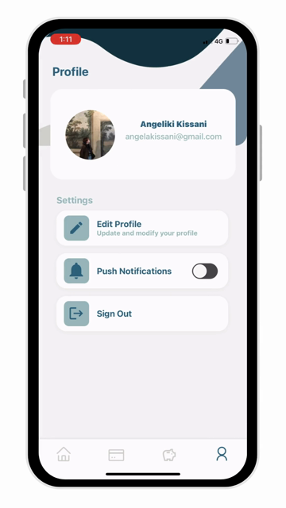

# BudgetPlanner: Expense Tracking and Savings Goals App


A cross-platform mobile app for tracking daily spending and saving towards
personal goals. Transactions are grouped into categories, so it's easy to see
where the money goes. Savings goals show how much to put aside each month to
reach them on time.

Built as my thesis project, *Design and Development of an Expense Management
and Budgeting Application* ([read the thesis](https://hdl.handle.net/10889/28419)).

<p align="center">
  
  <br>
  <em>App walkthrough (4× speed) · <a href="final.mp4">full video</a></em>
</p>

## Screens

| Sign in | Home | Transactions |
|---|---|---|
|  |  |  |

| Savings goals | New goal | Profile |
|---|---|---|
|  |  |  |

## Features

- **Accounts.** Sign up and sign in with JWT authentication, plus a "forgot
  password" flow that emails a reset code.
- **Spending overview.** The home screen shows the available balance, total
  savings, and a monthly bar chart of spending per category.
- **Transactions.** A searchable list grouped by date, with a category tag on
  each transaction. Users can recategorise transactions or create their own
  categories.
- **Savings goals.** Set a goal with a target amount, end date and icon. The app
  works out how much to save each month and tracks progress with progress bars.
  A transaction can also be assigned to a goal.
- **Profile.** Change name, password and profile picture, and toggle push
  notifications.

## Design process

The app follows a human-centred design approach. Before development, I ran a
survey through Google Forms to collect user preferences, and the results shaped
the key design and feature decisions, with the focus on simplicity and ease of
use. For testing, a Python script simulated realistic bank transactions.

## Tech stack

| Layer | Tools |
|---|---|
| Mobile app | React Native, Expo, Expo Router, React Navigation |
| UI and charts | React Native Paper, react-native-chart-kit, circular progress indicators |
| State | React Context (auth, transactions, categories, goals), AsyncStorage |
| Backend | Node.js, Express, MongoDB with Mongoose, hosted on Render |
| Services | JWT and bcrypt (auth), SendGrid (email), Cloudinary (images), node-cron |

## Running it

```bash
npm install
npx expo start
```

Then scan the QR code with the Expo Go app, or press `i` or `a` to open an iOS
or Android simulator.

## Project structure

```
app/            # Expo Router entry and screens (sign in, home, expenses, savings, profile…)
components/     # UI components grouped by feature (home, expenses, savings, profile…)
context/        # React Context providers: auth, transactions, categories, goals
constants/      # theme, icons
assets/images/  # logos, backgrounds, tab-bar and goal icons
docs/           # demo GIF and screenshots for this README
```
